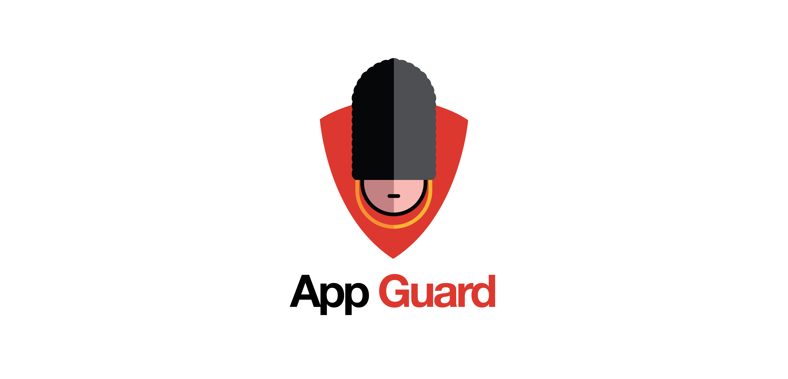
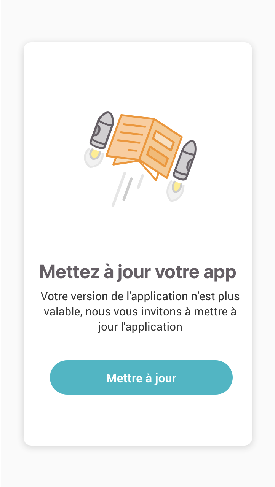
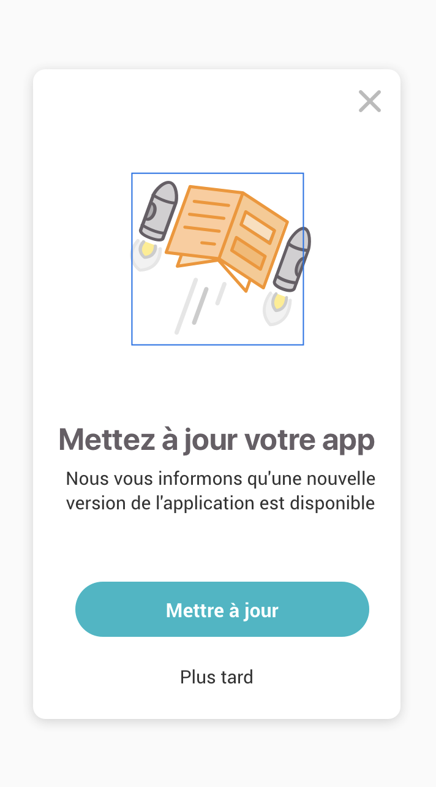
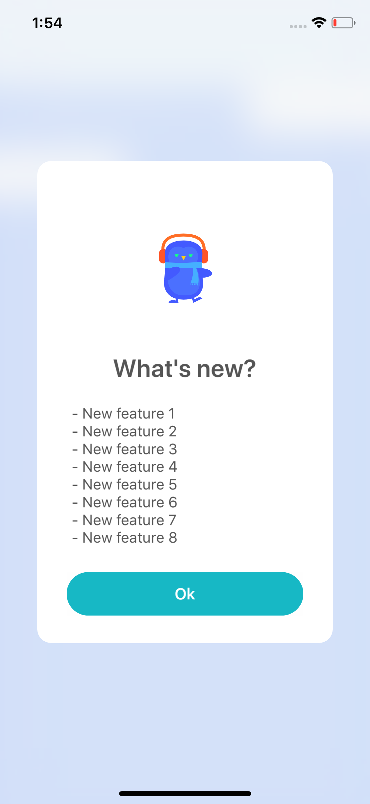
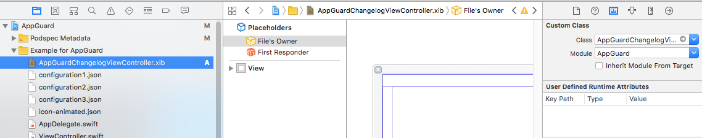
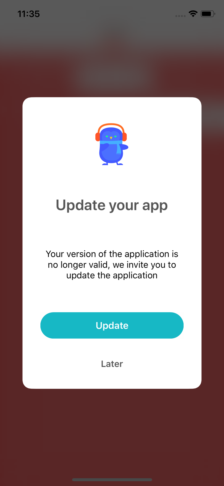
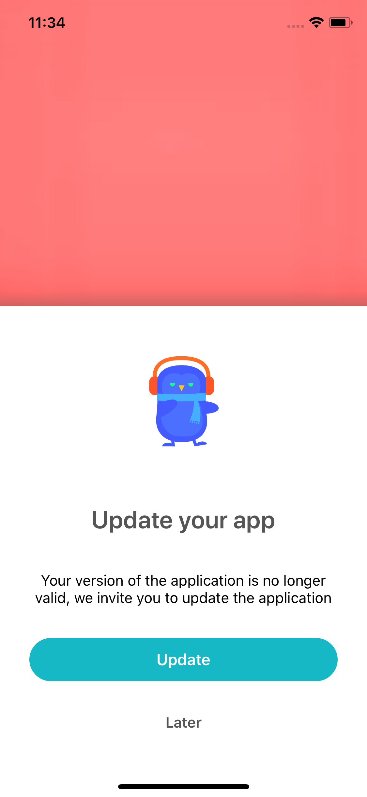

# 💂‍♀️ AppGuard

[](https://travis-ci.org/smartnsoft/AppGuard)
[](https://img.shields.io/cocoapods/v/AppGuard.svg?style=flat)
[](https://img.shields.io/cocoapods/l/AppGuard.svg?style=flat)
[](https://img.shields.io/cocoapods/p/AppGuard.svg?style=flat)



AppGuard is a guard 💂‍♀️ for your iOS app, to check / force users to update your app or show what changed.

<p align="center">  </p>

## Requirements

- iOS 9.0+
- Swift 4.2+
- Xcode 10.0+

## Example

To run the example project, clone the repo, and run `pod install` from the Example directory first.

## Installation

StarsKit is available through [CocoaPods](http://cocoapods.org). To install
it, simply add the following line to your Podfile:

```ruby
pod 'AppGuard'
```

## Third party dependencies

Today we have third parties dependencies, but the purpose is to avoid them the most.

We also wan to have a quick available library and significant customization, we use one dependency:

- [Jelly](https://github.com/SebastianBoldt/Jelly): a simple UI component to simplify the rating transition display

## Description & features

AppGuard offers three default behaviors for your app to:

1. Check and show to the user if a new version of your app **have to** be downloaded (**mandatory update**).
2. Check and show to the user if a new version of your app **should be** downloaded (**recommandated update**).
3. Show to the user **what's new** in the last version (**update informations**).

By a mecanism of revival displays, blocked or dimissable pop-up, the user will / may have to update your app according to the informations and actions displayed.

### Features list

- [X] Static configuration strings
- [X] Cocoapods integration
- [X] Default & configurable step transitions
- [X] Default display algorithm behavior
- [X] Customizable fonts, text & tint colors
- [X] Screen actions callbacks
- [X] Configurable with dictionary/data or remote URL: everything you want!
- [X] Overridable layouts
- [X] Lifecycle display events ([will/did]appear/disappear)
- [X] Configurable key for parsing
- [X] Firebase extension to bind Remote Config to StarsKit data
- [ ] Additional condition checking on the default check
- [ ] Carthage integration
- [ ] Use localizable or configuration strings
- [ ] Default localizable strings : 
- - [ ] EN
- - [ ] FR
- [ ] Overridable localizable strings
- [ ] Customizable display algorithm behavior


### Configurable metrics for display

You can specify metrics to trigger the default display behavior or use your own one.

- [X] Disable/enable the component
- [X] Version code (bundleVersion)
- [X] Static configuration strings
- [X] Maximum of days between display
- [X] Mandatory type: screen properties
- [X] Recommanded type: Feedback screen properties
- [X] Changelog type: Store review screen properties

## Default usage

### Init app guard

``` swift
// Simply use the prepare method for default configuration properties
AppGuard.default.prepare()

// Configure the dataSource
AppGuard.default.dataSource = self

// And optionnaly the uiDelegate
AppGuard.default.uiDelegate = self

```

### Implement the datasource

It's necessary to implement it to indicate the presenter controller to `AppGuard` and optionnally do something with the `UIImageView`.

``` swift
// MARK: - AppGuardDataSource
extension ViewController: AppGuardDataSource {
  func configureImageView(_ imageView: UIImageView?) {
    
	// Do anything with the UIImageView, 
	// 1- Download an Image with Kingfisher
	// 2- Add a Lottie animated subview on it
    
  }
  
  func guardPresenterController() -> UIViewController? {
    return self
  }
  
}

```

### Implement the UI delegate

The UI delegate will send you lifecycle and user interaction events.

It's strongly recommanded to implement `didChooseLater:` and `didChooseAction:`.

``` swift

// MARK: - AppGuardUIDelegate
extension ViewController: AppGuardUIDelegate {
  func guardControllerWillAppear(for context: AppGuardContextType) {
    print("guardControllerWillAppear")
  }
  
  func guardControllerDidAppear(for context: AppGuardContextType) {
    print("guardControllerDidAppear")
  }
  
  func guardControllerWillDisappear(for context: AppGuardContextType) {
    print("guardControllerWillDisappear")
  }
  
  func guardControllerDidDisappear(for context: AppGuardContextType) {
    print("guardControllerDidDisappear")
  }
  
  func didChooseLater(for context: AppGuardContextType) {
    print("didChooseLater")
  }
  
  func didChooseAction(for context: AppGuardContextType) {
    if context == .mandatoryUpdate || context == .recommandedUpdate {
      UIApplication.shared.openURL(URL(string: "https://itunes.apple.com/fr/app/<your app ID>")!)
    }
  }
  
}

```

### Update the AppGuard configuration

AppGuard use a simple Dictionnary data to update its configuration.

``` swift
let configurationData // a [String: Any?] instance from JSON file or static dictionnary or anything else
AppGuard.default.updateConfig(from: configurationData)

// Ask the guard 💂‍♀️ if we can pass 
AppGuard.default.displayUpdateStatus()

// You can force it too 💂‍♀️🤷‍♂️
AppGuard.default.displayUpdateStatus(forced: true)

```


### Custom keys binding

ℹ️ You can optionnaly specify the keys binding with the `AppGuardConfigurationKeysBinder`, to bind your source configuration to the AppGuard configuration. By default, the `AppGuardConfigurationKeys` rawValues will be used.

Imagine that you have a custom JSON structure like that:

``` json
{
  "my_deeplink_key": "http://www.google.custom",
  "my_dialog_type_key": 1,
  "my_content_key": "Custom content text",
  "my_action_label_key": "Custom action label",
  "my_changelog_content_key": "Custom changelog text",
  "my_title_key": "Custom title",
  "my_imageurl_key": "Custom image URL",
  "my_laterButtonLabel_key": "Later",
  "my_maxDaysBetweenDisplay_key": 3,
  "my_versionCode_key": 2
}

```

Change the default keys binding with the `AppGuardConfigurationKeysBinder`:

``` swift
let binding: [String: String?] = [AppGuardConfigurationKeys.deeplink.rawValue: "my_deeplink_key",
                                      AppGuardConfigurationKeys.dialogType.rawValue: "my_dialog_type_key",
                                      AppGuardConfigurationKeys.content.rawValue: "my_content_key",
                                      AppGuardConfigurationKeys.actionButtonLabel.rawValue: "my_action_label_key",
                                      AppGuardConfigurationKeys.changelogContent.rawValue: "my_changelog_content_key",
                                      AppGuardConfigurationKeys.title.rawValue: "my_title_key",
                                      AppGuardConfigurationKeys.imageUrl.rawValue: "my_imageurl_key",
                                      AppGuardConfigurationKeys.versionCode.rawValue: "my_versionCode_key"]

AppGuardConfigurationKeysBinder.bindConfigurationKeys(binding)

```

## Customization

### View controller customization

You can simply override the `.xib` name of default controllers:

- `AppGuardChangelogViewController`
- `AppGuardUpdateViewController`

For instance, create a `AppGuardChangelogViewController.xib` with the custom file's owner set to the StarsKit module. IBOutlets are optionnals so you decide what to override or not.

Don't forget the IBAction links!

<p align="center"></p>

NB: `UIViewController` custom classes support will be available soon.

### UI customization - `AppGuardGraphicContext`

The `AppGuardGraphicContext` can be set with your own values.

```
AppGuard.default.graphicContext.actionButtonBackgroundColor = UIColor.ex.fromHexa("#17b8c5")
AppGuard.default.graphicContext.jellyCustomTransition = myCustomJellyPresentation
```

Customizable properties are:

- `cornerRadius: CGFloat`
- `roundedButton: Bool`
- `actionButtonBackgroundColor: UIColor?`
- `actionButtonTitleColor: UIColor`
- `actionButtonFont: UIFont`
- `laterButtonBackgroundColor: UIColor?`
- `laterButtonTitleColor: UIColor`
- `laterButtonFont: UIFont`
- `titleFont: UIFont`
- `titleColor: UIColor`
- `contentFont: UIFont`
- `contentColor: UIColor`
- `image: UIImage?`
- `jellyCustomTransition: JellyPresentation`

### Transitions & display (Jelly)

AppGuard uses Jelly fro customizable transitions. You can specify your own via the `jellyCustomTransition` property in the `AppGuardGraphicContext`.

<p align="center"> </p>

Go to [Jelly repo](https://github.com/SebastianBoldt/Jelly) for more information.


### Strings customization (Coming Soon)

You can use the configurations strings or the Localizable ones, which you can override to in your app bundle.


## Use Firebase Remote Config

<p></p>

If your app already use Firebase, why not use the **Firebase Remote Config** feature?
AppGuard will be able to convert your associated Firebase remote configuration object to a readable data dictionnary for itself 👌.

### Installation

Add the Firebase Podspec

```ruby
pod 'AppGuard/FirebaseRemoteConfig'
```

``` swift

// Bind the properties keys if needed before 
// or use the default ones in the remote config

let remoteConfig = RemoteConfig.remoteConfig()
remoteConfig.fetch(withExpirationDuration: 1.second) { (status, _) in
	remoteConfig.activateFetched()
	AppGuard.default.updateConfig(from: remoteConfig)
	AppGuard.default.checkUpdateStatus()
}

```

## Contributors

Made in 🇫🇷 by the [Smart&Soft](https://smartnsoft.com/) iOS Team.

## License

AppGuard is available under the MIT license. See the LICENSE file for more info.
